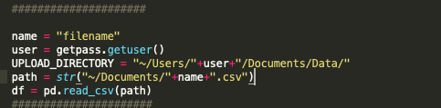

# DiskDash
Upload a csv to produce a chart. Accepts large files. 

### Steps for use:

1) Enter name of csv where <strong>"filename"</strong>

2) Select Disk Drive from Drop Down

3) Enjoy!

<figcaption>Instance names removed</figcaption>

### Future Work

Right now the chart works and is very accurate. It allows for drill down and image capture and has plenty of tools thanks to plotly. 
 1)I want to add new callbacks to populate bootstrap cards for other systems information. 
 2)I want to add the ability to add multiple files which will create multiple charts dynamically on the screen. 
 3)Create a button that exports a report with all the graphs and information and a narrative explaining the information. 

# More updates coming soon!
